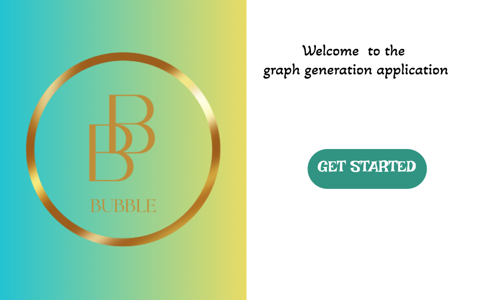
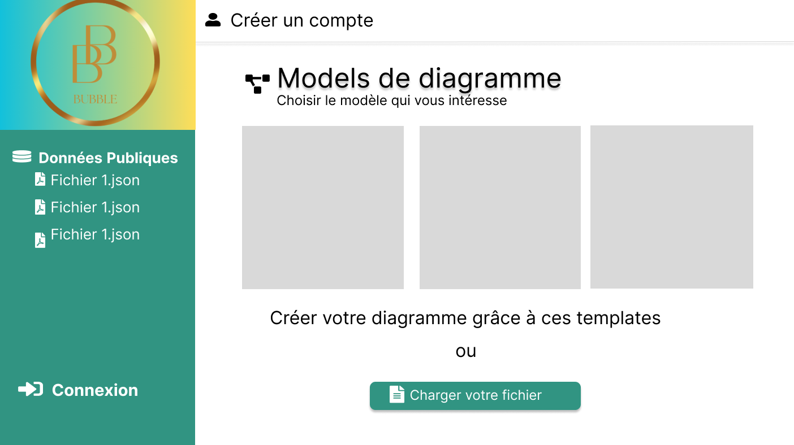

Version 2

# BUBBLES

L'application Bubbles est une application de visualisation de données, permettant à toutes personnes de visualiser
des données contenues dans un fichier JSON suivant un format bien défini ([Voir un exemple du fichier](../test_simple.json)) .
Avant l'importation du fichier, il sera demandé à l'utilisateur s'il voudrait mettre ses données en
public. Ceci permettra à d'autres utilisateurs d'avoir une idée du visuel que notre application propose
lorsqu'ils consulteront les données publiques. L'application permettra à l'utilisateur de choisir un modèle
de diagramme ou utiliser les paramètre de visualisation définir dans son fichier json (taille, couleur, police, etc.).
Il peut donc modifier la couleur des bulles, la taille, la police, les libellés des bulles.

## Contexte

Ce projet est réalisé dans le cadre de l'UE PDL enseignée en MASTER 1 MIAGE avec pour but de nous initier à la gestion de projets et
développer une application du début à la fin. 

### Membres de l'équipe
[DENAHOU Michael](michael-marino-d.denahou@etudiant.univ-rennes1.fr)

[THOO Graciela](omonliwi.thoo@etudiant.univ-rennes1.fr)

[TESSE WAMBA Loica](loica-cynthiche.tesse-wamba@etudiant.univ-rennes1.fr)

## Présentation de quelques interfaces

  
  

## Utilisation
Cette application peut être utilisée pour :
1. Visualisation de données : les utilisateurs peuvent importer leurs données et les visualiser tout les en explorant sous forme de 
diagrammes. Les professionnels peuvent aussi l'utiliser pour visualiser des données de recherches ou visualiser des données deu marché etc...
2. Partage de données : On a la possibilité de partager des données grâce à la possibilité de mettre des diagrammes en publique, ce qui peut a la longue ,
permettre d'accéder à un public plus large en créant ainsi une plateforme de partage de données visuelles.
3. Enseignement et formation : Bubbles peut être utilisé pour expliquer des concepts de visualisation de données, l'interpretation de deonnées et les étudiants
peuvent l'utiliser pour des projets scolaires aussi.
etc.
Cette application va offrir un outil polyvalent de visualisation de données qui peut être utilisé dans plusieurs domaines, de l'analyse de données au partage
d'information en passant par l'enseignement, la recherche et la présentation. Son potentiel est vaste et dépend des besoins 
spécifiques des utilisateurs.

## Documents de references
Nous mettons ici tous les documents que nous avons utilisés pour réaliser ce projet:
+ PDL.pdf : contient les informations du contexte de ce projet tel que donné par le client avec les deadlines, le
contexte et les attentes ([INFORMATIONS PROJET](PDL.pdf))
+ PDL.CDC : contient le cahier de charges du projet ([CAHIER DE CHARGES](PDL_CDC_V1.1.pdf))
+ DESIGN.md : regroupe des informations sur le design (diagrammes de l'application) ([DESIGN PROJET](DESIGN.md))
+ RECETTE.md : regroupe un ensemble de tests fonctionnels de l'application ([RECETTE PROJET](RECETTE.md))
+ INSTALL.md : décris comment installer le projet et le démarrer ([INSTALLATION PROJET](INSTALL.md))

## Diagramme à bulles
Nous utiliserons la librairie ECHART pour gérer tout ce qui concerne :

-Couleurs (diagramme, bulles, texte1)

-Formes (forme des bulles rectangle, caré, rond, etc.)

-Polices (police du text contenu dans les bulles)

## Technologies 

- Back end : SPRING BOOT 
- Versionning :GITLAB 
- Front end : VUE.JS
- Base de données : MYSQL

## Niveau actuel du projet
Nous avons principalement travaillé sur le front en ce qui concerne l'affichage et les modifications 
sur les diagrammes.
Les données utilisées par le diagramme sont fixes pour le moment. Nous travaillons sur l'extraction depuis 
des fichiers JSON. Nous avons actuellement des erreurs sur le côté Connexion que nous nous employons à corriger
En ce qui concerne le back, nous travaillons sur les end points et le chargement du fichier (machine-dossier local- base de données).
Nous n'avons pas encore réussi à extraire efficacement les informations, mais nous arrivons à générer
des graphes avec des données statiques et à modifier les graphes.

Nous comptons maintenant corriger les bugs que nous avons et finaliser la partie back end afin de terminer la génération des diagrammes. 
Nous évoluerons sur la connexion et les templates qui sont juste des diagrammes basiques avec des informations de forme fixes (mais qui peuvent être modifiés plus tard si le client le souhaite)

